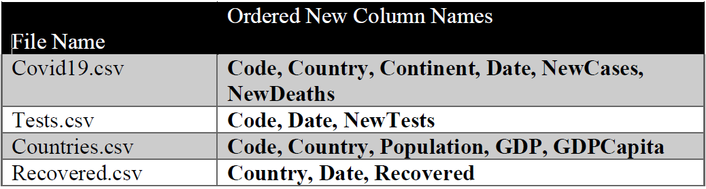

```{r setup, include=FALSE}
knitr::opts_chunk$set(echo = TRUE)
```

# Task 1: Data Preparation and Wrangling: 	(30 marks)

1.	import the data from the CSV files and store them into dataframes named appropriately. 

```{r}
# The code and code description of this component go below here
# loads required libraries
library("tidyverse")

# reads data from Covid19.csv as tibble
covid <-  read_csv("data/Covid19.csv")
head(covid)

# read data from Test.csv as tibble
test <- read_csv('data/Tests.csv')
head(test)

# read data Recovered.csv as tibble
recovered <- read_csv('data/Recovered.csv')
head(recovered)

# read Countries.csv as tibble
countries <- read_csv('data/Countries.csv')
head(countries)


```


2.	Tidy up the dataframe driven from the “Recovered.csv” files to be compatible with the dataframe driven from the “Covid19.csv” file, _i.e._, every observation should have a record of recovered patients in one country in a single day. 


```{r}
# The code and code description of this component go below here

# uses gather function to tranform the tibble from wide format to long format
# by gathering all column names except 'Country.Region' column into Date column(newly created)
# and all values in these gathered columns to Recovered column
recovered <- recovered %>% 
  gather(key = "Date", value = "Recovered", -Country.Region)
recovered

```
3.	Change the column names in the dataframes were loaded from the following files accordingly.




```{r}
# The code and code description of this component go below here

# renaming the columns
colnames(covid) <- c('Code', 'Country', 'Continent', 'Date', 'NewCases', 'NewDeaths')

colnames(test) <- c('Code', 'Date', 'NewTests')

colnames(countries) <- c('Code', 'Country', 'Population', 'GDP', 'GDPCapita')

colnames(recovered) <- c('Country', 'Date', 'Recovered')


```

4.	Ensure that all dates variables are of the same date format across all dataframes. 

```{r}
# The code and code description of this component go below here

class(covid$Date) # to check if it is already date
str(covid$Date) # to check the current format
covid$Date <- as.Date(covid$Date, format = "%Y-%m-%d")

class(test$Date) # to check if it is already date
str(test$Date) # to check the current format
test$Date <- as.Date(test$Date, format = "%Y-%m-%d")

class(recovered$Date) # to check if it is already date
str(recovered$Date) # to check the current format
recovered$Date <- as.Date(recovered$Date, format = "%Y.%m.%d")

```

5.	Considering the master dataframe is the one loaded from the “Covid19.csv” file, add new 5 variables to it from the other files (Recovered.csv, Tests.csv, Countries.csv). The 5 new added variables should be named (“Recovered”, “NewTests”, “Population”, “GDP”, “GDPCapita”) accordingly.

    [Hint: you may use the `merge` function to facilitate the alignment of the data of the different dataframes. You may use this format: `merge(x=df1,y=df2, [specify the merging dimension if needed])`, where df1 and df2 are the dataframes to be merged]

```{r}
# The code and code description of this component go below here

covid19_data <- covid %>%
  left_join(recovered, by = c("Country", "Date")) %>%
  left_join(test, by = c("Code", "Date")) %>%
  left_join(countries, by = c("Code", "Country"))

covid19_data


```

6.	Check NAs in the merged dataframe and change them to `Zero`. 

```{r}
# The code and code description of this component go below here


na_summary <- colSums(is.na(covid19_data))
na_summary

covid19_data <- covid19_data %>% 
  mutate_all(~replace_na(.,0))

colSums(is.na(covid19_data))

```

7.	Using existing “Date” variable; add month and week variables to the master dataframe. 
    
    [Hint: you may use functions from `lubridate` package]

```{r}
# The code and code description of this component go below here
covid19_data <- covid19_data %>%
  mutate(
    Month = month(Date),
    Week = week(Date)
  ) %>%
  select('Code', 'Country', 'Continent', 'Date', 'Month', 'Week', everything())

covid19_data

```

8. Add four new variables to the master dataframe (“CumCases”, “CumDeaths”, “CumRecovered”, “CumTests”). These variables should reflect the cumulative relevant data up to the date of the observation; _i.e._, CumCases for country “X” at Date “Y” should reflect the total number of cases in country “X” since the beginning of recording data till the date “Y”. 

    [Hint: first arrange by date and country, then for each new variable to be added you need to group by country and mutate the new column using the cumsum function]

```{r}
# The code and code description of this component go below here

covid19_data <- covid19_data %>% 
  arrange(Date, Country) %>% 
  group_by(Country) %>% 
  mutate(
    CumCases = cumsum(NewCases),
    CumDeaths = cumsum(NewDeaths),
    CumRecovered = cumsum(Recovered),
    CumTests = cumsum(NewTests)
  )
covid19_data

```

9. Add two new variables to the master dataframe (“Active”, “FatalityRate”). Active variable should reflect the infected cases that has not been closed yet (by either recovery or death), and it could be calculated from (CumCases – (CumDeaths + CumRecovered)). On the other hand, FatalityRate variable should reflect the percentages of death to the infected cases up to date and it could be calculated from (CumDeaths / CumCases). 

```{r}
# The code and code description of this component go below here

covid19_data <- covid19_data %>% 
  mutate(
    Active = (CumCases - (CumDeaths + CumRecovered)),
    FatalityRate =  ifelse(is.na(CumDeaths / CumCases), 0, (CumDeaths / CumCases) * 100)
  )

colSums(is.na(covid19_data))

```

10. Add four new variables to the master dataframe (“Cases_1M_Pop”, “Deaths_1M_Pop”, “Recovered_1M_Pop”, “Tests_1M_Pop”) These variables should reflect the cumulative relevant rate per one million of the corresponding country population, (i.e Cases_1M_Pop for country “X” at Date “Y” should reflect the total number of new cases up to date “Y” per million people of country “X” population)

    [Hint: Cases_1M_Pop = CumCases*(10^6) / Population)]

```{r}
# The code and code description of this component go below here

covid19_data <- covid19_data %>% 
  mutate(
    Cases_1M_Pop = CumCases*(10^6)/Population,
    Deaths_1M_Pop = CumDeaths*(10^6)/Population,
    Recovered_1M_Pop= CumRecovered*(10^6)/Population,
    Tests_1M_Pop= CumTests*(10^6)/Population
  )

```

**Task 1 final Report**: To ensure that this task has been finished correctly, run the following code and obtain the output as part of your knitted report. This will be used in marking this task.  

```{r}

problems(covid19_data) # in case if you are reading the data into tibbles

head(covid19_data)

cat("Number of columns is:", ncol(covid19_data), "and number of rows is:", nrow(covid19_data), "\n")

# check for specific values for the newly added columns, eg. deaths in a specific day
print(covid19_data$Recovered[10001])
print(covid19_data$NewTests[10001])
print(covid19_data$Population[10001])
print(covid19_data$GDP[10001])
print(covid19_data$GDPCapita[10001])
print(covid19_data$Cases_1M_Pop[6004])
print(covid19_data$Deaths_1M_Pop[6004])
print(covid19_data$Recovered_1M_Pop[6004])
print(covid19_data$Tests_1M_Pop[6004])

# check date format
is.na(as.Date(covid19_data$Date[200],  format = "%Y-%m-%d"))

# check week and month of a specific value
print(covid19_data$Week[3000])
print(covid19_data$Month[3000])

```

----

*** 